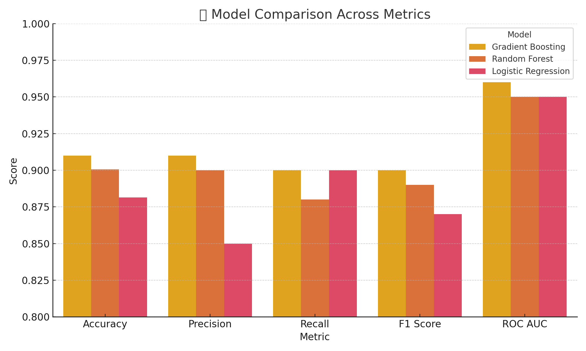

# 🧠 Mental Health Risk Prediction using Machine Learning

This project aims to predict whether a person is **at risk** or **not at risk** of attempting suicide based on mental health and lifestyle features using various supervised machine learning models.

## 📌 Project Overview

Mental health is a crucial aspect of overall well-being. With rising cases of depression, stress, and suicide attempts, this project uses machine learning to assist in identifying individuals at risk. The goal is to provide a data-driven foundation for early intervention.

## 🗃️ Dataset

- **Target Variable**: `Attempt_Suicide`
    - 0 → No Risk
    - 1 → At Risk
- **Source**: Clinical or survey-based data (preprocessed & cleaned).
- **Features**: Mental health indicators, lifestyle choices, and demographic variables.

## 📊 Preprocessing & Feature Engineering

- Handling missing values
- Label encoding and mapping:
    ```python
    df_cleaned['Attempt_Suicide'] = df_cleaned['Attempt_Suicide'].map({
        'Never Thought': 0, 
        'Thought': 1, 
        'Attempted': 1
    })
    ```
- We also resolved **spacing issues in categorical values** (e.g.,`"At Risk"` → `"No Risk"`), ensuring cleaner data preprocessing and better model performance.
- One Hot Encoding
- Feature selection using Chi-Square Test
- Train-test split

## 🤖 Machine Learning Models Used

- Logistic Regression
- Random Forest Classifier
- Gradient Boosting Classifier
- XGBoost Classifier
- LightGBM Classifier
- Support Vector Machine (SVM)
- K-Nearest Neighbors (KNN)
- Decision Tree Classifier

## 🏆 Evaluation Metrics

- Accuracy, Precision, Recall, F1-Score
- Confusion Matrix
- ROC-AUC Score
- Visualization of Top 3 Model Confusion Matrices
- ROC Curve for Top 3 Models

## 📊 Model Comparison



## 📈 Visualizations

- Heatmaps for Confusion Matrices of Top 3 Models
- ROC Curves with AUC Scores

## 📂 Results Summary

Top 3 models were selected based on accuracy and AUC. Their confusion matrices and ROC curves were visualized for interpretation and comparison.


## 🙏 Acknowledgements

Inspired by the need for early mental health detection using AI & ML.

---

## 🧑‍💻 Author
Made with ❤️ by Zazan Ali (2025) 
